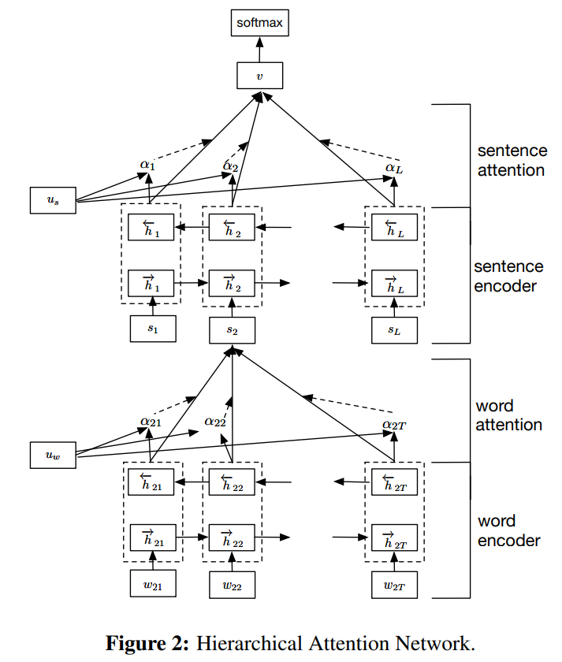
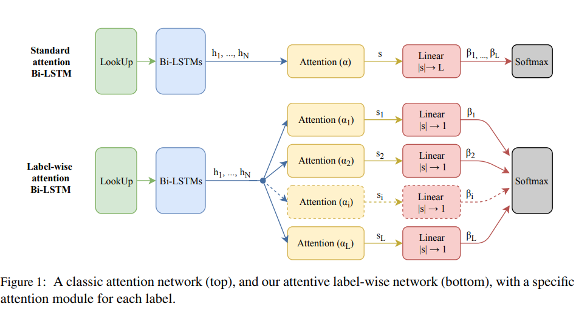
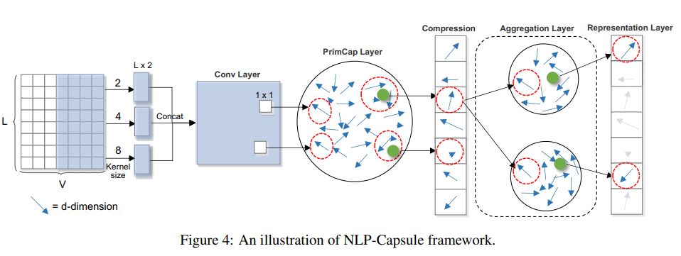

#  Hierarchical Capsule Networks with Attention for Document Classification
This repository provides easy to use hierarchical architectures for document classification.

## Contents
| Section | Description |
|-|-|
| [Theoretical background](#theoretical-background) | Theoretical building blocks of this repo |
| [Setup](#setup) | How to setup a working environment |
| [Architectures](#architectures) | Available models |
| [Data and Preprocessing](#data-and-preprocessing) | How to prepare and utilize a (custom) dataset |
| [Training/evaluating](#training/evaluating) | Train and evaluate a model |
| [Using FastText](#using-fasttext) | Create custom word vectors or baseline model |
| [Using ULMFiT](#using-ulmfit) | Using ULMFiT as word encoder and to create document encodings |
| [Hyperparameter optimization](#hyperparameter-optimization) | Finding optimal hyperparameters using [Hyperopt](https://github.com/hyperopt/hyperopt) |
| [References](#references) | References for this repo | 

# Theoretical background
- Towards Scalable and reliable Capsule Networks
- Hierarchical Attention Networks
- ULMFiT
- Dynamic Routing Between Capsules

# Setup

[1] Install anaconda:
Instructions here: https://www.anaconda.com/download/

[2] Create virtual environment:
```
conda env create --name hcapsnet python=3.7
source activate hcapsnet
```
[3]
Install PyTorch (>1.1). Please refer to the [PyTorch installation page](https://pytorch.org/get-started/locally/) for the specifics for your platform.

[4] Clone the repository:
```
git clone https://github.com/mrvoh/HCapsNet.git
cd HCapsNet
```
[5] Install the requirements:
```
pip install -r requirements.txt
```
# Architectures
## Hierarchical Attention Networks
[Hierarchical Attention Networks (HAN)](https://www.aclweb.org/anthology/N16-1174/) are at the basis of this repository. This model first creates an encoding of each sentence in a document by first contextualizing the word embeddings with some form of an RNN (a GRU in the paper) and then applying self attention to compute a weighted average as sentence embedding (level 1).
Level 2 of the hierarchy then consists of the same "trick": all sentence embeddings are contextualized using some form of a RNN and then a document encoding is created by applying self attention of the contextualized sentence embeddings and computing a weighted average. This document encoding then serves as an input to a classification layer (softmax) to get the final prediction.
See the graph below (taken from the original paper) for a visualization of the model.



## Hierarchical Label-Wise Attention Networks
The hierarchical Labelwise Attention Networks are a mixture of HAN and Label-Wise [Attention Networks](https://www.aclweb.org/anthology/D18-1508/) Instead of a single LSTM-encoder, the hierarchical document encoder from HAN is used and instead of the single self-attention head, one self-attention head per modelled label/class is applied to the contextualized sentence encodings. See below for a visualization of Label-Wise Attention (taken from the original paper).


## Hierarchical Capsule Networks
Hierarchical Capsule Networks (HCapsNet) are the main contribution of this repository. The base of this network is the same as [HAN](#hierarchical-attention-networks), but instead of simply applying a softmax to perform classification, the Capsule Network as described in [Towards Scalable and Reliable Capsule Networks for Challenging NLP Applications](https://www.aclweb.org/anthology/P19-1150/) is used for classification.
Instead of modeling a text as a bag of word n-grams as per original paper, we model a text/document in a hierarchical manner and apply the Capsule Network to the document encoding. The Capsule Network upsamples each dimension of the document encoding using 1x1 convolutions to create capsules (vector representations of the previously scalar-valued feature). These capsules are consecutively "compressed" for robustness and scalability and then routed to the representation/output layer. The length of each of the capsules of the output layer is interpreted as the probability that that respective class/label is present. See the original paper for a more elaborate explanation. The steps described above are depicted in the graph below (taken from the original paper).


## Hierarchical Capsule Networks with Multi-Head Attention
The final available architecture is an extension of HCapsNet. Instead of using one self-attention head to create the document encoding, N attention heads are used, resulting in an $N x D_{sen}$ document representation instead of the original $1 x D_{sen}$ vector representation, with $D_{sen}$ the size of the sentence encodings.

# How to use
Below all parameters/settings are discussed per respective topic. The total of parameters and a set of example values can be found in the config file, ```parameters.ini```. All parameters can be altered by either adjusting its value in the config file or by passing a value on the command line, e.g. ```python main.py --train_batch_size 32```.

## Data and preprocessing
### Parameters
```
[Data]
train_path = dataset/trec/train.pkl                       # Path with preprocessed documents for training
dev_path = dataset/trec/dev.pkl                           # Path with preprocessed documents for development
test_path = dataset/trec/test.pkl                         # Path with preprocessed documents for testing
preload_word_to_idx = false                               # Load or create new word mapping
word_to_idx_path = dataset/trec/stoi1.json                # Where to load/store word mapping
label_to_idx_path = dataset/trec/label_to_idx.json        # Where to load/store label mapping


[Preprocessing]
preprocess_all = false 			# Create new dataset
dataset_name = trec 			# Name of dataset to create
write_data_dir = dataset/trec 	        # Where to store created dataset
restructure_docs = true 		# Restructure text to be more equal in sequence lengths within doc
balance_dataset = true 			# only for parsing from sheet (csv/xlsx)
max_seq_len = 100 		        # cut-off value for restructuring docs
min_freq_word = 2 		        # Minimal frequency for a word to be considered
percentage_train = 0.8	 		# Percentage of data to use for training
percentage_dev = 0.0 			# Percentage of data to use for development (sheet parsing only)
```
#### Supported datasets
Currently the following datasets are supported:

| Name | Description | Binary/Categorical | Num classes | Parameter value<sup>1</sup> |
|-|-|-|-|-|
| [EUR-LEX57k](https://arxiv.org/abs/1906.02192) | European legislations annotated with VOC concepts | Binary | 4k+ | eur-lex57k |
| [IMDB](https://dl.acm.org/doi/10.5555/2002472.2002491) | IMDB movie review sentiment classification task | Binary | 2 | imdb |
| [RCV1](http://www.ai.mit.edu/projects/jmlr/papers/volume5/lewis04a/lyrl2004_rcv1v2_README.htm) | Reuters news article categorization | Binary | 90 | reuters | 
| [TREC](https://dl.acm.org/doi/10.3115/1072228.1072378) | Question classification | Categorical | 6 OR 50 | trec |
|[20NewsGroups](http://qwone.com/~jason/20Newsgroups/)| Twenty News Groups news article classification | Categorical | 20 | 20news |

<sup>1</sup> Value to fill in for ```dataset_name``` to utilize this dataset.

### Document model
This repo uses a standardized data format to preprocess and store datasets. Each sample is converted to a Document (see ```document_model.py```), which stores: the raw text, the preprocessed text in the form of a list of sequences (sentences), the original filename if applicable and its tags/labels.
The text is normalized and preprocessed specifically for the module that creates the word embeddings (either FastText of ULMFiT) and split in sentences using the SpaCY sentence tokenizer.

When **restructure_docs** is set to true, the sentences obtained by the SpaCY tokenizer are split into smaller fragments whenever their length is greater than ```max_seq_len```. Firstly, this is attempted by splitting the text on punctuation such as ';'.  When the sentence is still too long, it is greedily split into sequences of maximum size ```max_seq_len``` .
Finally, all consecutive sequences are considered once more and if their combined length is smaller than ```max_seq_len``` they are concatenated into one sequence.
Doing this allows for more efficient training, but can potentially harm performance, although this has not been seen in practice yet.
### Adding custom datasets
Training on your own data is fairly easy and can be done in two manners:
#### Reading from *.csv
Reading from *.csv files is supported by setting ```dataset_name = sheet``` in the parameters file. The sheet should contain one column named ```text``` and at least one column which name is preceded by ```topic_ ``` containing a binary indicator for that row whether that topic/label is present for the respective sample.

#### Writing a custom parser
When reading from a *.csv file does not give enough freedom, a custom parser can be written like the ones in the ```data_utils/ ``` folder. The parser should write a pickled list of Documents (as per ```document_model.py ```) to the ```write_dir``` and preferably also adhere to all other preprocessing variables.

Then, ```main.py``` should be adjusted to include the newly created parser as an option next to the current options.
## Training/evaluating
### Parameters
TODO: explain parameters in hcapsnet and ulmfit section also influence training.
```
[Training]
do_train = true                     # Whether to train the model
do_eval = true                      # Whether to evaluate on test set
save_dir = models                   # Directory to save models during training
binary_class = false                # Whether current classification problem is binary
train_batch_size = 16               # Batch size to train on
eval_batch_size = 32                # Batch size for evaluation
learning_rate = 0.0025              # Learning rate
dropout = 0.33                      # Dropout between sent encoder and doc encoder
num_train_epochs = 30               # Number of epochs to train for
eval_every = 272                    # Evaluate on dev set after eval_every training updates
K = 1                               # DEPRECATED
weight_decay = 0.001                # L2 weight regularization weight
label_value = 0.95                  # Label value for computing loss (binary classification only)

[Model]
model_name = Hcapsnet               # Name of the model to use
word_encoder = gru                  # Name of word encoder to use
sent_encoder = gru                  # Name of sentence encoder to use
embed_dim = 300                     # Embedding dimension of word vectors
word_hidden = 100                   # Hidden size of word encoder
sent_hidden = 100                   # Hidden size of sentence encoder
```
### Logging
In order to track the training process, multiple ways of logging are provided. Firstly, all training/evaluating related terminal output is saved in a log file. Secondly, at every evaluation a report is written with precision and recall metrics on all classes.
Finally, [Tensorboard](https://www.tensorflow.org/tensorboard) can be used to track training (almost) in real time. Vital metrics such as training and development loss are captured and can be inspected in the Tensorboard interface.
The following parameters can be used to alter write locations of the logging methods:
```
[Logging]
log_path = log.txt                     # Path to write terminal log to
class_report_dir = class_reports       # Dir to write classification reports to
tensorboard_dir = runs                 # Dir to write Tensorboard log files to
```

# Using FastText
The [FastText](https://fasttext.cc/) library is an easy-to-use toolbox for creation of word vectors and text classification. Here it can be used to create custom word vectors on your dataset, utilize pretrained word vectors or as a baseline classifier. Please see the [official documentation](https://github.com/facebookresearch/fastText#building-fasttext) for installation.
### Parameters
```
[FastText]
word_vec_path = word vectors/custom.bin             # Path to read/write word vectors from/to
create_wordvecs = true                              # Whether to create custom word vectors on dataset
use_ft_baseline = false                             # Whether to use FastText as classifier baseline
ft_save_path = fasttext.model                       # Path to save classifier
ft_n_epoch = 200                                    # Number of epochs to train (both word vectors and classifier)
ft_minn = 3                                         # Min number of characters used in char n-grams
ft_maxn = 6                                         # Max number of characters used in char n-grams
ft_lr = 0.05                                        # Learning rate
```

# Using ULMFiT
- Train custom language model
- Usage
- Document encodings

# Hyperparameter optimization
In order to find (near-)optimal hyperparameters for your task at hand, ```hyper_opt.py``` can be used. It is implemented using the [Hyperopt](https://github.com/hyperopt/hyperopt) library, which needs te be installed before usage by running ```pip install hyperopt```.
For now, only HCapsNet is supported and the following parameters are optimized over the following intervals:

| Name | Lower bound | Upper bound | Scale |
|-|-|-|-|
| dropout | 0.25 | 0.75 | uniform |
| weight_decay | 1e-5 | 0.1 | log uniform |
| sent_hidden | 25 | 200 | discrete uniform |
| dropout_caps | 0.0 | 0.6 | uniform |
| lambda_reg_caps | 1e-7 | 1e-2 | log uniform |
| num_compressed_caps | 50 | 250 | disrete uniform |
| KDE_epsilon | 0.01 | 0.1 | uniform |
| dropout_factor | 1.0 | 3.0 | uniform |
| min_freq_word | 1 | 50 | discrete uniform |
| label value | 0.9 | 1.0 | uniform |

**NOTE**: Not all hyperparameters listed above will influence the training process at the same time, this depends on the exact architecture chosen via the ```parameters.ini``` file. E.g. ```dropout_factor``` only influences the process when ulmfit is chosen as ```word_encoder```.
## Usage
See below the parameters for the hyper optimization with their default values. In order to alter their values, command line arguments have to be used, as demonstrated below.
```
max_evals = 50                                          # Number of rounds to optimize for
K = 3                                                   # Number of folds for cross validation
preload_trials = false                                  # Whether to continue optimizing from a previous run
in_trials_path = tmp_trials.pkl                         # Path to read previous trials from
out_trials = trials.pkl                                 # Path to store trials object
log_path = opt_log.txt                                  # Path to write overview after optimization
config_path = parameters.ini                            # Parameters file containing all parameters not altered by optimization
data_path = dataset/trec/train.pkl                      # Dataset to optimize on
label_to_idx_path = dataset/trec/label_to_idx.json      # Label mapping path
```
After every round of optimization the script stores a Hyperopt-native object containing the information of the optimization so far in ```trials_tmp.pkl ```. This is done to prevent loss of information when optimization is ended prematurely.

**Example usage** ```python hyper_opt.py --data_path dataset/trec/train.pkl --label_to_idx_path dataset/trec/label_to_idx.json ```

# References


